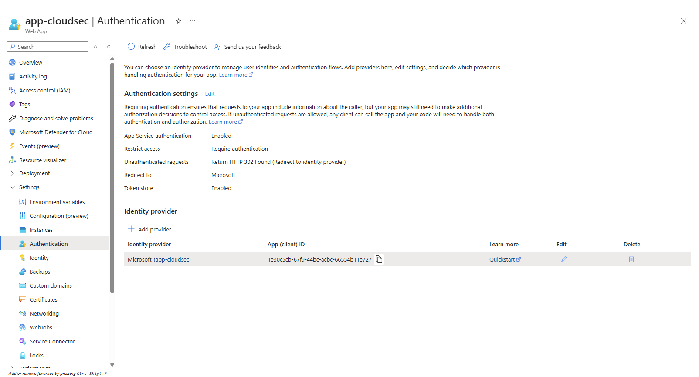
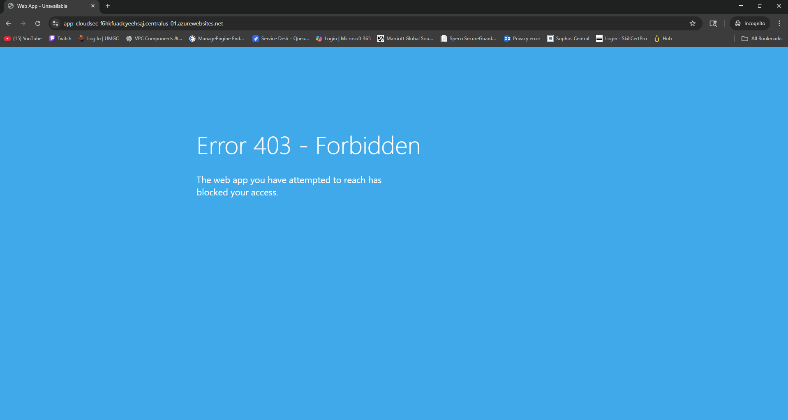
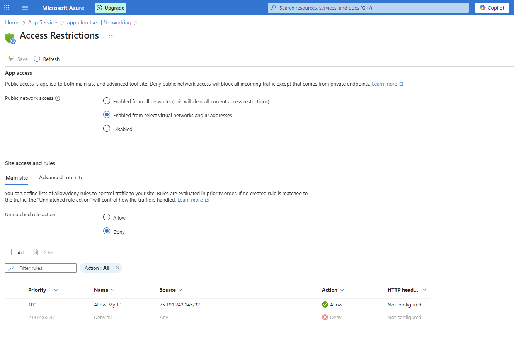
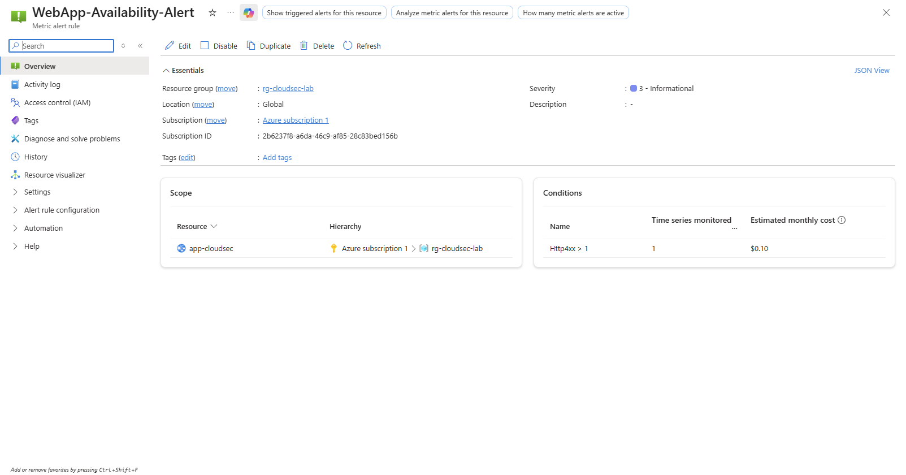

# Secure Azure Web Application (Cloud Cyber Engineer Project)

## Overview
This project demonstrates the design and implementation of a secure Azure web application using managed cloud services. The focus is on identity-based access control, reduced attack surface, monitoring, and documenting security engineering tradeoffs under real-world service-tier constraints.

This project reflects how cloud security engineers design secure systems while balancing cost, platform limitations, and operational requirements.

---

## Architecture Summary
**Service Model:** Platform as a Service (PaaS)  
**Cloud Provider:** Microsoft Azure  

Components:
- Azure App Service (Free Tier)
- Azure Entra ID (Authentication & RBAC)
- IP-based Access Restrictions
- Azure Monitor Alerts
- App Service Logs (Log Stream)
- Microsoft Defender for Cloud (Posture Awareness)

Internet
|
HTTPS (Platform-Managed TLS)
|
Azure App Service
|
Entra ID Authentication
|
Access Restrictions (Allow + Deny)

---

## Security Controls Implemented

### Identity & Access Management
- Azure Entra ID authentication enforced
- Anonymous access blocked
- Least-privilege RBAC applied at resource group level

### Network Security
- Access restrictions configured to allow only trusted IPs
- Default deny rule enforced
- Private Endpoint unavailable on Free tier and documented as a production enhancement

### Transport Security
- HTTPS enforced by Azure App Service
- Platform-managed TLS
- Custom TLS configuration not exposed on Free tier

### Monitoring & Alerting
- Azure Monitor alert configured on HTTP 4xx responses
- Alerts detect authentication failures, unauthorized access, or probing activity

### Logging & Observability
- App Service logs enabled
- Runtime activity validated using Log Stream
- Log Analytics export unavailable on Free tier and documented

---

## Security Evidence

### Azure Entra ID Authentication Enforced
Azure App Service authentication is enabled using Azure Entra ID. Unauthenticated requests are not permitted, enforcing an identity-first access model.

---

### Anonymous Access Blocked
Unauthenticated access attempts to the application result in an HTTP 403 Forbidden response, confirming that anonymous access is denied.

---

### Network Access Restrictions (Default Deny)
Inbound access to the application is restricted using explicit allow rules with a default deny policy, reducing public exposure and limiting access to approved IP addresses only.

---

### HTTP 4xx Monitoring and Alerting
An Azure Monitor alert is configured to detect elevated HTTP 4xx responses, enabling visibility into authentication failures, unauthorized access attempts, and abnormal request patterns.

---

### Observability & Platform Constraints
Due to Azure Free-tier diagnostic limitations, application behavior was validated through platform-level metrics and access enforcement rather than full diagnostic logging. These constraints were documented as part of the security assessment.

## Engineering Tradeoffs
Due to Azure Free-tier limitations:
- Virtual Machines were not available (vCPU quota)
- Private Endpoint was not supported
- Centralized logging to Log Analytics was unavailable

Compensating controls were implemented and production-ready improvements documented.

---

## Production Enhancements
In a production environment, this design would include:
- Private Endpoint and VNet integration
- Web Application Firewall (WAF)
- Centralized logging to Log Analytics or SIEM
- Managed Identity for service-to-service authentication

---

## Documentation
Additional documentation:
- [Architecture](architecture.md)
- [Security Decisions](security-decisions.md)
- [Monitoring & Alerts](monitoring-alerts.md)
- [Limitations & Future Work](limitations-and-future-work.md)

---

## Author
Camron Whittaker  
Cloud Security / Cybersecurity Engineer
